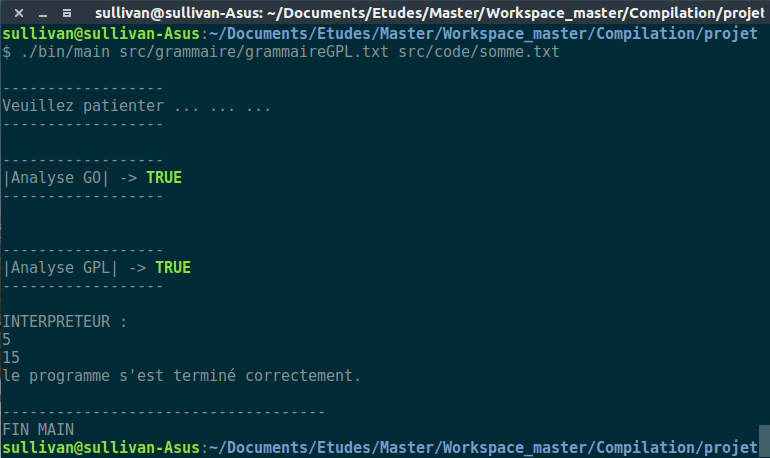
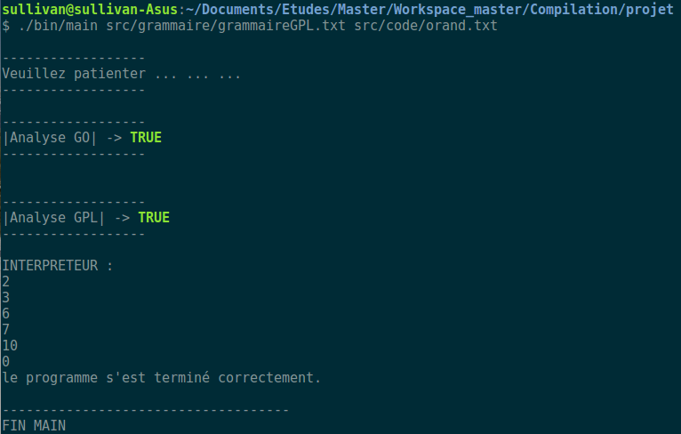

# Projet Compilation

# Ou trouver le projet :

https://github.com/PineauSullivan/Workspace_master/tree/master/Compilation/projet

# Lancer l'application

	Make
	./bin/main <chemin_fichier_grammaire> <chemin_fichier_code>

# Exemples

## Exemple somme.txt

## Exemple orand.txt

# Tester simplement une grammaire
Si vous souhaitez seulement tester une grammaire, il vous suffit de faire :

	./bin/main <chemin_fichier_grammaire>

# Date
04/2017

# Développeurs 
Sebastien Vallée et Sullivan Pineau.